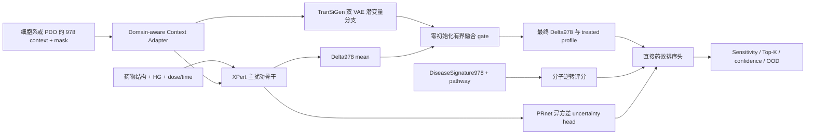

# DrugScreenChampion V1：统一扰动预测—细胞系筛药—类器官泛化计划

> **SUPERSEDED / 已取代。** 本草案已由
> [`experiments/records/EXP-008.md`](records/EXP-008.md) 的正式实验记录取代，
> 仅作为设计历史保留，不再代表当前 EXP-008 数据契约、假设或执行状态。

## 一、结论与路线选择

[旧方案](</D:/Code/DrugScreenLab/基于统一扰动机制、转录扰动预测与疾病表达谱逆转的类器官药物筛选研究方案.md>)值得保留，而且它比当前零散实验更接近最终产品。应保留：

- 从 LINCS 扰动学习，到细胞系药效预测，再到 PDO 泛化的完整路径。
- 统一 978 landmark gene 空间、疾病签名、机制逆转和 OOD 置信度。
- 训练输入与真实筛药推理输入分离。
- 先在细胞系验证，再迁移到类器官。
- 输出候选药物排序，而不只是复现表达矩阵。

但必须修正四个核心问题：

1. **1,319,138 条 GSE92742 profile 不是可直接训练的 10 μM/24 h 数据集。**它混合处理类型、剂量、时间和重复。当前可靠起点是 XPert 官方 SDST：78,453 条、8,382 个药、164 个细胞、10 μM/24 h、QC 后并具备匹配 `X_ctl`。
2. **疾病逆转不能再作为唯一药效路径。**EXP-007 已表明当前 6 h reversal construct 与 PRISM 多日存活率接近无信号。Champion 必须同时包含直接药效排序头，并分别保留分子逆转分数。
3. **EXP-006 不能证明 genetic transfer 普遍无效。**其中 warm-test 暴露和 B@20/100 累积化学训练破坏了公平比较；UniPert/genetic representation 只能作为后续零初始化可选模块。
4. **不能在 XPert 基线未复现时堆模块。**先完成一次官方五折复现，后续模型迭代只用固定开发划分、单 seed；只有候选模型达到实用门槛才增加 seed 和外部验证。

比较过三种实施方式：

- 直接执行旧方案全栈：覆盖全面，但数据依赖多、反馈慢。
- 端到端重新造大模型：代码快，但无法判断基线和新增模块各自贡献。
- **采用：单一 Champion + 分阶段激活模块。**一个模型、一个 checkpoint、统一接口；XPert 主干先工作，TranSiGen、PRnet、UniPert 等模块通过零初始化 gate 逐步加入。兼顾“集大成”和快速迭代。

## 二、最终模型框架

生产系统只有一个可训练模型 `DrugScreenChampionV1`，数据重建、疾病签名和评估器是确定性组件，不另算模型。



### 2.1 XPert 主骨干

- 以官方 `XPertNet` 为唯一主干：matched control、UniMol 药物表示、heterogeneous graph、cross-attention。
- 官方源码保存在 `data/external/xpert_source`，视为不可变外部依赖；不复制其训练框架和重复工具代码。
- DrugScreenLab 只实现薄适配层、统一 checkpoint、数据 contract 和干净评估。
- `gate=0` 时输出必须与官方 XPert 数值等价，最大误差 `<1e-6`。
- 当前 10 epoch checkpoint 和 EXP-005/006 均不算正式 XPert 基线。[XPert 原始论文](https://www.nature.com/articles/s42256-025-01165-w)

### 2.2 TranSiGen 双 VAE 模块

TranSiGen 借鉴的是双 VAE 去噪与潜空间转换，不把它误写成辅助损失创新。[TranSiGen 论文](https://www.nature.com/articles/s41467-024-49620-3)、[作者代码](https://github.com/myzhengSIMM/TranSiGen)

- `ControlVAE: 978 → 1200 → μ/logvar(100)`
- `TreatedVAE: 978 → 1200 → μ/logvar(100)`
- `Decoder: 100 → 800 → 978`
- 潜变量 transition 接收 control latent、XPert 药物/context 表示及 dose/time。
- `TreatedVAE` 只在训练时作为 teacher，推理时禁止读取处理后表达。
- 有界残差融合：

  `Δfinal = Δxpert + gvae × (Δvae − Δxpert)`

  其中 `gvae = 0.25 × tanh(raw_gate)`，初始化为 0，避免 VAE 过度平滑直接破坏 XPert。

### 2.3 PRnet 借鉴模块

不再复现完整 PRnet，也不把 978→12,328 的线性推断当作可靠真值。只借鉴两个工程上有价值的设计：

- 输出每个基因的 `delta_logvar[978]`，表达预测不确定性。
- 为未来多剂量、单细胞数据保留条件接口。

输出均值用于排序，方差用于客观OOD，不允许不确定性头反向改变基线均值。[PRnet 论文](https://www.nature.com/articles/s41467-024-53457-1)、[作者代码](https://github.com/Perturbation-Response-Prediction/PRnet)

### 2.4 非 LINCS context adapter

CCLE/PDO basal RNA-seq 不能伪装成 XPert 的 matched `X_ctl`。

- 输入：样本内 rank-normalized exact978、缺失 mask、domain 类型。
- 结合 XPert 的 gene/PPI embedding，产生与 XPert control encoder 对齐的 `978×256` token。
- 用 42 个非 CRC 的 CCLE↔LINCS 重叠细胞训练 latent alignment。
- 10 个 CRC 重叠细胞冻结，留给筛药验证。
- 对 LINCS matched control 仍走官方 XPert 路径，不经过 adapter。

### 2.5 同一模型内的药效排序头

EXP-007 已证明 reversal-only 不足，因此直接药效头是必要组成，不是独立模型。

输入六类表示：

- XPert perturbation CLS。
- 预测 Delta978 摘要。
- TranSiGen latent delta。
- 药物全局表示。
- 细胞/PDO context 表示。
- reversal、condition、coverage、uncertainty 特征。

各自投影到 128 维，拼接后经 `768→512→128→1`，输出 `sensitivity_score`，统一规定越高越敏感。

训练损失：

- 主损失：同一 cell/PDO 内 pairwise ranking。
- 辅助损失：`0.2 × Huber(within-context percentile response)`。
- 第一阶段冻结扰动生成器。
- 排序信号通过后，才允许解冻顶部 perturbation block、transition 和 gates，并加入 LINCS replay：

  `Ljoint = Lscreen + 0.1 × Lexpression`

同时保留：

- `molecular_reversal_score`：机制层输出。
- `sensitivity_score`：实际筛药主输出。
- `confidence/OOD`：可靠性输出。

### 2.6 后续可选模块

KPGT、显式 Drug–Target–Pathway、UniPert genetic representation、连续 dose/time residual 均预留相同 adapter 接口，但初始 gate=0。每次只激活一个模块；未改善药效开发集或导致 Delta Spearman 下降超过 0.01 即移除。

## 三、数据集、训练集和评估集

### 3.1 扰动表达基础模型

| 用途 | 数据 | 训练/评估方式 |
|---|---|---|
| 官方复现 | XPert SDST 78,453 | 官方 cold-cell 五折和 cold-drug 五折 |
| Champion 训练 | 同一 SDST | 单一干净 TRAIN/DEV/LOCKED 划分 |
| 后续扩容 | GSE92742 1,319,138 原始 cache | 重新 QC、匹配 control、MODZ 后才允许使用 |
| 暂缓 | sci-Plex/PANACEA/WTS 扩展 | V1 筛药通过后再接入 |

#### 官方复现划分

完全复现官方配置：978 genes、hidden 256、8 heads、batch 128、最多 2500 epochs、官方四项 loss 和 cold split。

官方训练代码把 test 当 validation，因此该结果标记为 `PAPER_COMPAT_NOT_CLEAN`，仅回答“能否复现论文”，不用于 Champion 选择。

执行顺序：

1. 先跑 cold-cell fold1 和 cold-drug fold1。
2. 若指标与论文/source data 的差异在 `max(0.02, 5%)` 以内，再并行跑剩余四折。
3. fold1 通过后即可并行开发 Champion 骨架和 Screen-A，但所有创新结果在五折完成前标为 provisional。
4. 后续创新不再重复五折。

#### Champion 干净划分

使用官方 fold1 identity 构建一个固定版本化划分：

- 官方 cold-cell fold1 test cells：全部锁定。
- 官方 cold-drug fold1 test drugs：全部锁定。
- 剩余 cell/drug 中各按固定 hash 抽 10% 为开发 identity。
- `TRAIN`：train cell × train drug。
- `DEV_CELL`、`DEV_DRUG`、`DEV_DOUBLE`：对应单冷和双冷开发集。
- `LOCKED_CELL`、`LOCKED_DRUG`、`LOCKED_DOUBLE`：只在 release candidate 阶段使用。

表达主指标：

- row-macro Delta978 Pearson、Spearman。
- RMSE、MAE、R²、正负调控 Precision@20。
- 预测标准差及常数预测检查。
- treated-profile 指标只作次要报告。

#### 1.319M 数据重建

不能沿用当前 `phase1.py` 的“先排序取 control”逻辑作为最终数据。

新 builder 必须：

1. 限定 `trt_cp` 和合规 vehicle control。
2. canonicalize compound identity 后再 split。
3. 严格匹配 plate、cell、time、dose 的 control。
4. 应用可追踪 QC。
5. 对重复 signature 使用 MODZ collapse。
6. 首先重建 10 μM/24 h，并与官方 SDST 在样本数、药物数、细胞数、Delta 分布和重叠样本上对账。
7. 对账通过后才建立 MDMT/多剂量数据。

官方 SDST 始终保留为初始权威基准。

### 3.2 PRISM 细胞系药效

PRISM 是药效头的训练和评估数据，标签统一转换为“越大越敏感”。

#### Screen-A：最快看到 CRC 细胞系效果

- 只使用 10 个 XPert/PRISM/CRC 直接重叠细胞。
- 细胞按固定 identity 分为 7 train、3 dev。
- 药物按 canonical identity/Murcko scaffold 分为 70% train、15% dev、15% locked。
- 训练仅访问 train cell × train drug。
- 主评估：3 个 dev cells × dev drugs 的 double-cold。
- locked drugs 不参与调参。

工程推进门槛：

- per-cell median Spearman ≥ 0.20。
- 至少 7/10 细胞方向为正。
- Top-20 enrichment ≥ 1.5。
- 比 chemistry+context ablation 高 ≥ 0.03。

若 Screen-A 不通过，优先检查标签方向、药物映射、cell context、head 容量和 loss，不跑多 seed、五折或 bootstrap。

#### Screen-B：扩展到全部 35 个 PRISM CRC 细胞

- 使用 CCLE adapter 接入全部 35 条 CRC line。
- 细胞 identity 固定分为 25 train、5 dev、5 locked。
- 沿用相同 scaffold-aware drug split。
- 主要开发指标：double-cold dev。
- release 门槛：

  - median Spearman ≥ 0.30。
  - Top-20 enrichment ≥ 2.0。
  - 超过 chemistry+context baseline ≥ 0.05。
  - Delta978 DEV Spearman 相对 XPert 不下降超过 0.01。

只有达到该门槛的候选才增加两个 seed，总计三个 seed；不重复五折。

### 3.3 MCRC PDO：近期类器官主评估集

当前仓库已有比旧方案预期更完整的公开 PDO 数据：Mendeley `hr94h42xdc.3`，包含表达、原始剂量反应和 DSS。[公开数据](https://data.mendeley.com/datasets/hr94h42xdc/3)

现有可用交集：

- 91 个 PDO sample。
- 52 位患者。
- 25 个已映射 LINCS 药物。
- 1,774 条 PDO–drug DSS。
- PDO 表达与 XPert 978 重叠 975/978；DAXX、ST7、NPEPL1 缺失并显式 mask。

不能依赖历史 MCPIRE 处理产物。必须从已登记的 raw Data S2/S4/S5 在 DrugScreenLab 内重新生成 exact978、DSS、drug mapping 和 split；旧 processed 文件只用于数量审计。

固定拆分：

- 患者原子化：36 train / 8 dev / 8 locked。
- 药物按 Murcko scaffold 和覆盖度平衡：17 train / 4 dev / 4 locked。
- 同一患者的多个病灶不得跨 split。
- 指标先按 PDO 聚合，再按患者 macro，避免多病灶患者权重过高。

评估顺序：

1. **Zero-shot DEV**：冻结细胞系 Champion，不读取 PDO 训练标签。
2. 若存在正信号但不足门槛，只训练低容量 PDO context/residual adapter。
3. 只使用 36×17 train 调整 adapter，8×4 dev 调参。
4. 8×4 locked double-cold 只在 release candidate 打开一次。

PDO 工程信号门槛：

- Zero-shot：患者宏平均 Spearman ≥ 0.15、Top-5 enrichment ≥ 1.5、≥60% 患者方向为正。
- Adapted release：Spearman ≥ 0.25、Top-5 enrichment ≥ 2.0，并超过 chemistry+PDO-context ablation ≥ 0.05。

这些是实用工程 gate，不作为统计显著性结论。

### 3.4 其他数据的定位

- GSE117548 是 morphology activity AUROC，不是 viability/DSS/IC50；只能用于 5 药物、11 PDO 的外部方向检查，不能作为主要 Top-K endpoint。
- GDSC 等 PRISM 候选模型形成后再做一次外部验证。
- GSE280506/GSE145308 等 genetic organoid 用于后续机制适配，不阻塞 PDO DSS V1。
- GSE64392、sci-Plex、PANACEA、WTS 扩展均不作为近期依赖。

## 四、实施阶段与决策 Gate

### 阶段 0：整理数据和需求真相

预期成本：CPU 数小时；决策价值最高。

- 将旧方案重写为 `NOW / NEXT / LATER` 三层。
- 明确区分已观测事实、当前假设和未来扩展。
- 冻结 XPert SDST、PRISM、CCLE、MCRC PDO 的 dataset ID、checksum、identity map、split 和 forbidden data。
- 从 XPert supplementary/source data 固化论文五折精确目标值，不再靠正文图估数。
- EXP-006/007 只保留为历史证据，不作为 Champion 的公平基线。

### 阶段 1：一次性 XPert 复现

预期成本：fold1 约 8–12 GPUh；完整五折约 80–120 GPUh，两张 A5000 并行预计 2–4 天。

- 先完成两个 fold1 gate。
- fold1 失败立即停止剩余 folds，修正数据、loss、validation、checkpoint 或 metric。
- fold1 通过后剩余 folds 后台并行；不阻塞 Champion 接口和 Screen-A 数据管线建设。
- 完成后永久冻结 `XPert_REPRO_BASELINE_V1`。

### 阶段 2：Champion 骨架和表达能力

预期成本：3–6 GPUh/候选。

顺序固定：

1. XPert wrapper 与 gate=0 parity。
2. PRnet uncertainty head。
3. TranSiGen 双 VAE 有界残差。
4. 固定 clean DEV 单 seed 评估。
5. 只保留满足以下条件的版本：

   - Delta Spearman 不下降超过 0.01。
   - prediction std 不塌缩。
   - VAE/uncertainty 输出有限且 calibration 改善。
   - 不访问 treated expression 推理输入。

### 阶段 3：PRISM Screen-A

预期成本：每轮 <1–2 GPUh。

- 冻结表达主干，仅训练 ranking head。
- 一次迭代只改一项：药物映射、context、loss、head 或融合 gate。
- 每轮只跑固定 split、单 seed。
- 未达到 `median Spearman 0.20` 前不启动五折、多 seed、显著性检验或复杂机制模块。

### 阶段 4：CCLE adapter 与 Screen-B

预期成本：adapter <1 GPUh，联合训练 2–6 GPUh。

- 使用非 CRC 重叠细胞训练 context alignment。
- 在全部 35 个 CRC 细胞上评估 double-cold。
- 通过 Screen-B release gate 后才允许接入新的知识模块。

### 阶段 5：MCRC PDO 快速泛化

预期成本：数据重建 CPU 数小时；zero-shot <30 分钟；adapter <2 GPUh。

- 从 raw 数据重建 PDO contract。
- 先报告 zero-shot dev。
- 有方向性信号再训练 PDO adapter。
- 若 zero-shot 和 adapter 均无信号，优先优化 context domain alignment、DSS 标签和 drug coverage，不扩展到遗传扰动或 WTS。

### 阶段 6：集大成模块逐个激活

激活顺序：

1. KPGT 药物表示。
2. 显式 Drug–Target–Pathway。
3. UniPert chemical/genetic representation。
4. 连续 dose/time residual。
5. genetic organoid mechanism adaptation。
6. 重建后的 1.319M MDMT。
7. sci-Plex/WTS 和外部 GDSC。

每个模块只有在固定开发集提升实用指标且不破坏 Delta 时保留；没有提升就删除，不保留“论文装饰模块”。

## 五、代码与公共接口

### 5.1 代码收敛

新代码收敛为四个入口：

- `src/drug_screen/modeling/champion.py`：单一模型、模块和 checkpoint。
- `src/drug_screen/data/champion.py`：统一数据 contract、identity 和 split。
- `src/drug_screen/evaluation/champion.py`：表达、PRISM、PDO 指标。
- `scripts/modeling/run_champion.py`：`reproduce-xpert / train-expression / train-screen / eval-pdo` 四种模式。

现有 `xpert_extension.py`、`xpert_adapter.py` 仅提取经过测试的通用部分；`exp006_transfer.py` 和 EXP-006 launch scripts 保留为历史实验，不成为生产训练入口。

### 5.2 输入输出类型

```text
ChampionBatch
  context978: float[B,978]
  context_mask: bool[B,978]
  context_domain: lincs_control | basal_rnaseq | pdo_rnaseq
  drug_graph / unimol_atoms / hg_features
  dose_um: float[B]
  time_h: float[B]
  disease_effect978?: float[B,978]
  disease_mask?: bool[B,978]

ChampionOutput
  delta_mean: float[B,978]
  delta_logvar: float[B,978]
  treated_mean: float[B,978]
  sensitivity_score: float[B]
  molecular_reversal_score?: float[B]
  ood_score: float[B]
  module_gates: dict[str,float]
```

每个 checkpoint 必须携带：

- dataset/split IDs 与 checksum。
- official XPert revision。
- gene/drug/cell/PDO mapping version。
- activated modules 和 gate 值。
- label direction。
- config、seed、训练命令和 git revision。

## 六、测试与验收

必须在 WSL2 Conda `drugscreening-gpu` 中执行。

### 数据测试

- XPert SDST 精确验证 78,453×978、10 μM、24 h、QC=1、matched `X_ctl`。
- 训练、dev、locked 的 cell、drug scaffold、patient identity 无泄漏。
- MCRC 从 raw 重建后数量、checksum 和 975/978 gene overlap 可复现。
- PRISM/DSS/morphology 标签方向分别测试。
- locked label 在非 release 模式下访问即失败。
- 缺失基因只通过 mask 处理，不静默填成真实零表达。

### 模型测试

- 所有 gate=0 时 XPert parity `<1e-6`。
- 推理接口不接受 treated expression。
- TranSiGen gate 始终位于 `[-0.25,0.25]`。
- `delta_logvar` clamp 后无 NaN/Inf。
- LINCS、CCLE、PDO 三类 context 都能完成同一 forward。
- 保存—加载后预测与 gate 完全一致。

### 评估测试

- row-macro、cell-macro、PDO-macro、patient-macro 单位明确。
- 相同预测手工样例能验证 Spearman、NDCG、Recall、enrichment。
- 同一患者多个病灶不会重复加权。
- `sensitivity_score` 始终越高越敏感。
- 分子逆转排名与药效排名分别输出，禁止混成单一含义不明的总分。

## 七、实验治理与交付

下一正式实验为 **EXP-008**，只设一个主要假设：

> 在 XPert 官方复现 gate 通过后，XPert-based 单一 Champion 通过有界 TranSiGen latent correction、PRnet uncertainty head 和模型内直接药效排序头，在冻结的 PRISM CRC double-cold DEV 上优于 chemistry+context ablation，同时 Delta978 DEV Spearman 下降不超过 0.01。

MCRC PDO zero-shot 作为预声明的次要工程 readout；只有 PRISM 出现信号后，PDO adaptation 才建立后续独立 EXP。

审批包应同步重写旧方案、数据 contract、split manifest、EXP-008 record 和 `PROJECT_STATE.yaml`。当前环境没有 `research-experiment` skill，因此按仓库治理模板生成等价设计包。获得 `APPROVE EXP-008` 后，才修改正式研究代码或启动训练。

默认假设：

- 近期最高优先级是尽快得到可信的 CRC 细胞系指标和 MCRC PDO zero-shot 结果。
- 五折只做一次 XPert 基线复现。
- 日常迭代固定 split、单 seed。
- 只有达到 release gate 才运行额外两个 seed和一次外部验证。
- 不以 p-value、bootstrap 或重复五折阻塞工程推进。
- 不依赖 MCPIRE_PDO、TriPerturb 或历史不可追溯 processed asset。
