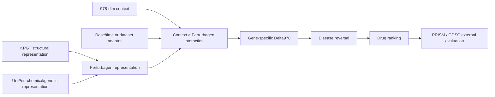

# DRUGSCREENLAB RESEARCH EXTENSION REPORT

日期：2026-08-13
研究策略：`BUILD ON ESTABLISHED PRIORS, TEST OUR EXTENSIONS`
运行环境：WSL2 + Conda `drugscreening-gpu`
本轮证据级别：`FAST / MEDIUM engineering-and-feasibility evidence`，不是 formal multi-seed 结论。

## Executive decision

当前程序决策：`CONTINUE_WITH_EXTENSIONS`。

已有 Context+Chemical Phase-1 结果保留为 `SUPPORTED FOUNDATION`：在 random-group、cold-drug、cold-context 的 bounded FAST 试验中，context-conditioned backbone 相对 Chemical-only 有方向一致的增量；这不是本轮重新证明的命题。20k Medium 只用于检查该方向是否在扩大样本后仍存在，结果仍为正，但效应低于 2k 单点，故不升级为 formal claim。

本轮真正的新知识是：

1. UniPert 替换 Morgan 的负结果应标为 `UNIPERT_REPLACEMENT_NO_SIGNAL`，不能写成 UniPert 整体失败；additive KPGT+UniPert 路径已实现，但 KPGT 权重当前不可审计，E1 暂停于资产 gate。
2. LINCS↔PRISM 的 response-blind compound identity bridge 已从 4-drug metadata 扩展到 4,686 个 PRISM Broad treatment identities、4,532 个 Broad base compound IDs；其中 1,851 个 unique base IDs 通过直接 `pert_id`/identity 规则进入 formal-eligible identity 层，alias-only 与 ambiguous 仍被排除在正式 cohort 外。
3. 官方 UniPert 遗传端已为 256 个本地参考 gene symbols 生成 256 维表示，并覆盖 1,392 个 LINCS genetic perturbagen IDs；这证明表示端可运行，但没有把它误写成 genetic→chemical transfer gain。
4. GDSC 的官方新入口和字段 contract 已准备，但当前 checkout 尚未获得带 release/checksum 的 response asset；因此外部 cross-study 仍为 `NOT_RUN_EXTERNAL_ASSET_UNAVAILABLE`。
5. GSE280506 与 GSE145308 已达到 organoid metadata readiness，但两者是 genetic/context adaptation reference，不是 chemical sensitivity ground truth；PDO full benchmark 继续 deferred。

## Unified backbone and evidence boundary

固定不变：GSE92742 exact-978 gene universe、matched control、train/validation/test role、group-atomic split、train-only normalization、Delta978 target 和 downstream response-label firewall。新 representation 只能改变 `Perturbagen representation`，不能回写 endpoint 或 external evaluation。

## Foundation status

| Foundation item | Status | Interpretation |
| --- | --- | --- |
| Context + Chemical Phase-1 backbone | `READY` | 既有 2k FAST 结果已显示 context 增量；本轮 20k Medium 仍保留正向增量，但只作 scaling sanity |
| XPert / MultiDCP prior | `READY` | 作为 reference architectural prior，不重复做 prior re-proof |
| KPGT source code | `READY` | 官方源码已固定到 `data/external/kpgt_source`，revision `47dc1646c70b2138a157de481d24a1ac35d174cd` |
| KPGT pretrained weights | `BROKEN` | 官方 Figshare share 当前被 WAF/私有状态阻断；本 checkout 没有权重或历史 KPGT embedding |
| Existing UniPert replacement probe | `UNIPERT_REPLACEMENT_NO_SIGNAL` | 2,048 random-group single-seed：Chemical+Context group-macro Spearman `0.337334`；UniPert replacement `0.134926` |
| UniPert additive role | `UNRESOLVED_EXTENSION` | 不由 replacement probe 否定；等待 KPGT-compatible additive fusion 的可审计输入 |

### 20k Medium foundation scaling

| Model | Group-macro Spearman | Group-macro Pearson | RMSE | Prediction variance |
| --- | ---: | ---: | ---: | ---: |
| Chemical-only | `0.05010` | `0.05542` | `1.25894` | `0.02277` |
| Context+Chemical | `0.18696` | `0.19068` | `1.22643` | `0.30027` |

该结果的用途是确认扩大到 20k 后 context signal 仍未坍缩；它不替代 registered large/full、多 seed、bootstrap 或 Independent Reviewer。产物：`artifacts/phase1/medium_20000_random_group/summary.json` 与 `candidate.pt`（本地 ignored）。

## E1 — KPGT + UniPert additive value

### Implementation

已实现：

- `src/drug_screen/modeling/phase2_fusion.py`：以 `pert_id` 对齐两个 frozen feature table，检查 finite float32、row mapping、shape 和 checksum 后做 additive concatenation。
- `scripts/modeling/build_phase2_kpgt_unipert_manifest.py`：生成 `phase1_context_kpgt_unipert_manifest_v1`，原 records、split、control、endpoint 全部冻结。
- `tests/modeling/test_phase2_fusion.py`：覆盖 row-order mismatch 和 missing identity rejection。

### Evidence status

`BLOCKED_KPGT_PRIOR_ASSET_UNAVAILABLE`。

官方 KPGT README 指向的 pretrained model share 当前返回私有/WAF challenge，且当前 repository 与 all-local-git search 均未发现可审计 KPGT embedding 或历史 fusion artifact。因此没有用 Morgan、随机投影或未经核验的替代品冒充 KPGT，也没有把 E1 写成 negative science result。审计文件：`mvp/extension/KPGT_PRIOR_COMPATIBILITY_AUDIT.json`。

E1 下一步唯一必要输入：KPGT feature table、`pert_id → row` mapping、source revision、weight SHA256、extraction command 和 canonical structure digest。资产到位后可直接运行 unified chemical backbone，不再经过 Morgan-vs-UniPert replacement branch。

## E2 — Genetic→Chemical low-data transfer

### Representation readiness

已使用官方 UniPert genetic encoder 做 label-blind FAST feature generation：

- feature shape：`[256, 256]`；
- encoded genes：`256`；
- mapped LINCS genetic perturbagen IDs：`1,392`；
- invalid genes：`0`；
- model SHA256：`06b065c2768b440077bdb1488f654b310f67a04c01fceb9f4791043558bfd322`；
- audit：`mvp/extension/GENETIC_UNIPERT_FAST_AUDIT.json`。

### Transfer status

`GENETIC_RESPONSE_ADAPTER_PENDING`。

下一轮保留一个主要假设：共享 `Context + Perturbagen → Delta978` interface 下，genetic pretraining/joint training 能否在 chemical supervision 从 100% 降到 50/20/10/5% 时改善 chemical prediction 及 downstream reversal ranking。当前尚未把 GSE92742 genetic rows 或 organoid rows 强行当作同一 chemical endpoint；dose/time、control 和 dataset-specific target adapter 仍需先冻结。

Contract：`mvp/extension/GENETIC_CHEMICAL_LOW_DATA_CONTRACT.md`。

## E3 — Downstream reversal → PRISM / GDSC

### PRISM bridge

`BRIDGE_READY_RESPONSE_BLIND`。

本轮只读取 PRISM treatment metadata 与 LINCS `pert_info`，没有读取 PRISM response values。审计：`mvp/extension/LINCS_PRISM_IDENTITY_BRIDGE_AUDIT.json`；derived bridge：`artifacts/extension/lincs_prism_identity_bridge.csv`（local ignored）。

| Bridge layer | Count | Decision |
| --- | ---: | --- |
| PRISM unique Broad treatment identities | `4,686` | metadata inventory |
| PRISM unique Broad base compound IDs | `4,532` | compound-level identity inventory |
| LINCS `trt_cp` perturbagens | `20,413` | identity universe |
| direct identity-eligible unique base IDs | `1,851` | eligible for later predeclared cohort review |
| alias-only candidates | `225` | retain as candidate metadata, not formal cohort |
| ambiguous alias rows | `65` | exclude until curated identity resolution |
| unmatched treatment rows | `2,465` | exclude |

正式 cohort 仍保持原冻结 4 drugs，直到 candidate list、context support、mapping digest 和 response-independent eligibility 全部重新冻结。当前 exact LINCS context 仍为 `11/35` PRISM lines，`24/35` 使用 reference-context fallback；fallback 不得与 individualized-context evidence 混为一谈。

### GDSC

状态：`NOT_RUN_EXTERNAL_ASSET_UNAVAILABLE`。

GDSC frozen contract 已写入 `mvp/extension/GDSC_FROZEN_BENCHMARK_CONTRACT.md`，现有 strict evaluator 是 `src/drug_screen/evaluation/cross_study.py`。官方 Sanger/Cell Model Passports 入口已定位，但当前尚未锁定可登记 release、文件字节与 checksum；因此不生成伪造 labels、不用二手数据替代，也不把这一状态解释成 GDSC negative result。

## E4 — Target / Pathway coverage and transfer

状态：`FORWARD_PREPARATION_COMPLETE`，当前 learned increment 仍 `NOT_RUN_COVERAGE_INSUFFICIENT`。

ChEMBL / Reactome provenance 已可用于 forward preparation，但 4-drug PRISM cohort 不足以拟合 additive target/pathway weight。下一步覆盖 LINCS chemical universe，冻结 target/action/affinity/confidence → STRING → Reactome/GO 的低维 prior，再在 OOD/transfer split 上评估；禁止用 PRISM labels 选择 pathway weight。

## Cell-Line Gates

| Gate | Definition | Status | Reason |
| --- | --- | --- | --- |
| A | PRISM identity, compact response schema, exact-978 disease signature and learned ranking path are reproducible | `PASS_WITH_LIMITS` | 4-drug compact asset is frozen; current support is feasibility-scale |
| B | predicted reversal retains downstream signal under context-stratified PRISM evaluation | `PROMISING_FAST` | existing exact-context and all-line results are directional feasibility evidence; 24 fallback lines remain a support mismatch |
| C | one official external GDSC frozen evaluation completes with exact support and no tuning leakage | `BLOCKED` | official asset version/checksum not yet acquired and registered |

Cell-Line program status remains `PARTIAL`, not `GREEN`。

## Organoid readiness

`METADATA_READY_ADAPTATION_PENDING`。

- `GSE280506`：primary human gastric organoid，CRISPRi/CRISPRa，DMSO/cisplatin，single-cell RNA-seq；可作为 genetic/context adaptation reference，但没有足够的 chemical dose-response ground truth。
- `GSE145308`：human intestinal organoid，WT/APC/ARID1A/SMARCA4 perturbations，0h/24h，three replicates；存在 GPL20301/GPL24676 双平台，必须显式处理 platform/batch。

只有 Cell-Line Gates A/B/C 足够后，才运行一个小型 genetic→chemical organoid feasibility probe；不提前宣称 PDO benchmark 或 clinical efficacy。

## Largest bottleneck and next decision

程序级最大瓶颈仍是 `matched-support downstream validation`：compound identity 已能从 4-drug 扩展到 metadata-level bridge，但 exact context support、GDSC external asset 和可审计 KPGT weights 仍未同时闭环。立即优先级：

1. 取得并审计 KPGT feature asset，直接运行 KPGT+UniPert additive backbone；
2. 锁定 Cell Model Passports 的 GDSC release/checksum，并完成不调参的 frozen evaluator；
3. 为 genetic feature table 冻结 response adapter，运行 100/50/20/10/5% chemical supervision FAST probe；
4. 扩大 target/pathway coverage 后，再进入 OOD/transfer；
5. Gate C 达成后再做 organoid small probe。

## Reproducibility and known deviations

- 所有 Python、测试、数据处理和模型运行均要求 WSL2 `drugscreening-gpu`；
- raw data、large cache、checkpoints 和 full bridge CSV 不提交 Git；tracked reports 只保存 asset IDs、paths、checksums、contracts 和 compact metrics；
- 未修改原始数据、未改变 Q 定义、split、control 或 endpoint；未使用 test/external labels 调参；
- historical KPGT+UniPert internal evidence 在当前 checkout 未核验，故标记 `PRIOR_INTERNAL_EVIDENCE_UNVERIFIED_REPOSITORY_HISTORY`；
- 本轮未启动 Independent Reviewer，因为 E1/KPGT asset gate 和 E2 response adapter 尚未形成可审查的 unified milestone。
